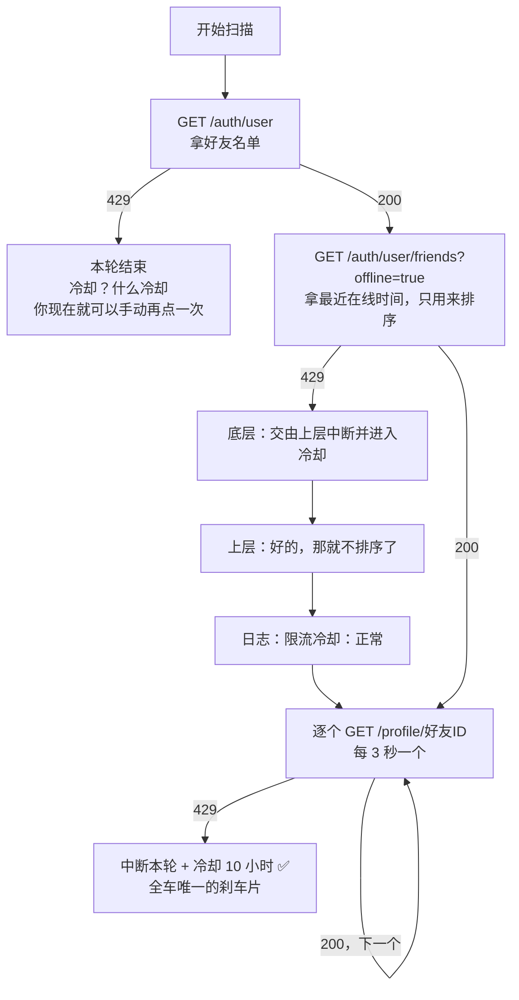
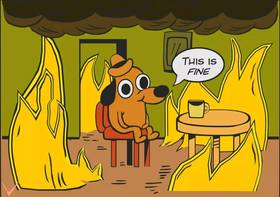
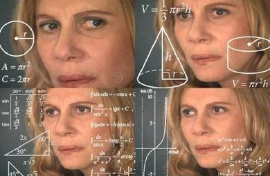
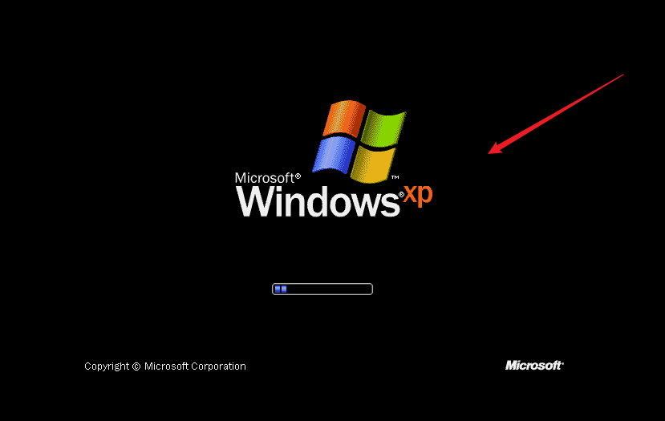
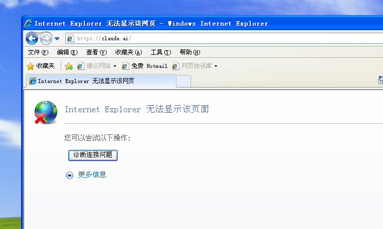
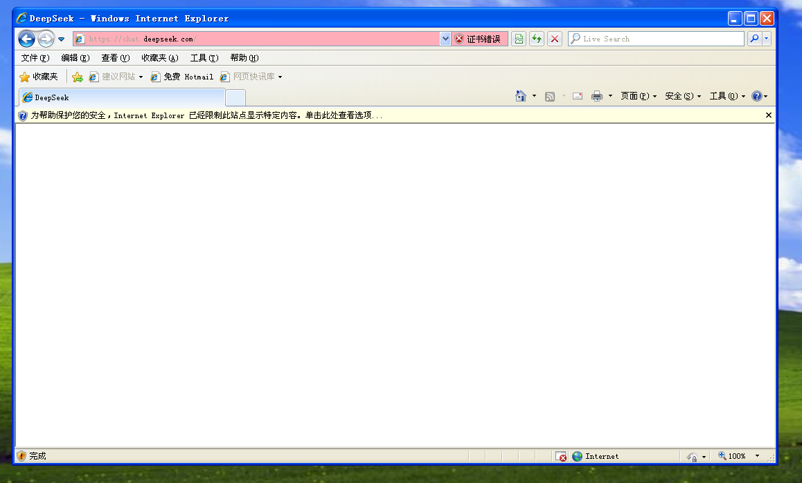

# 测评和反馈

在我在GitHub上看到这个雷霆东西之后秉承赤石精神对这个东西的源码进行了品鉴，由于笔者比较怕死不敢拿真号去试VRChat的429，所以是用mock把VRChat服务器模拟了一遍然后拿作者的原版代码跑的，以下是笔者的一些品鉴体验。

首先进行一下省流：

这是一个正宗老狗屎，堪比我声称我造了一台带[行车记录仪](https://zh.wikipedia.org/zh-hans/%E8%A1%8C%E8%BD%A6%E8%AE%B0%E5%BD%95%E4%BB%AA)的三轮车，然后这台三轮车号称装了自动刹车，结果三个轮子只有一个装了刹车片；车门号称上了锁，但这把锁只防隔壁车主，谁坐进驾驶座都能打开；车上的行车记录仪包装盒上写着"记录每一次变化"，实际上十个小时才拍一张照片，路上颠一下就关机睡十个小时，内存卡读不出来就直接格式化，换司机的时候还有概率把上一个司机的录像存进下一个司机的内存卡。集三轮车和行车记录仪之短，去其精华，取其糟粕。

现在你很难放心地用这个东西记录任何人的简介变化，可能作者看到[VRCX](https://github.com/vrcx-team/VRCX)把"Feed Bio Changes"[判定为"不可修复"](https://github.com/KobayashiSouryuu/VRCBioWatcher/blob/d03ce9f63e144bb6f805d0863b459834cecc3746/README.md?plain=1#L56)之后觉得自己行了，然后在订阅了[Claude Max](https://claude.ai/new#settings/billing)或者别的什么Max之后直接开启了`/loop`开始[力大砖飞](https://addyosmani.com/blog/loop-engineering/)迭迭代代，最终成功制作出了这个雷霆大肥美狗屎。

## 然后我看到作者在[读我.妈的](https://github.com/KobayashiSouryuu/VRCBioWatcher/blob/d03ce9f63e144bb6f805d0863b459834cecc3746/README.md#%E5%B7%A5%E4%BD%9C%E5%8E%9F%E7%90%86)里画了一张"工作原理"图，但是笔者认为绘制的不太准确，以下是笔者使用[Mermaid](https://mermaid.js.org/)™️在5[普朗克时间](https://zh.wikipedia.org/zh-hans/%E6%99%AE%E6%9C%97%E5%85%8B%E6%97%B6%E9%97%B4)内绘制的更加准确的429处理流程图

<details>
<summary>点击观赏</summary>



</details>

## 正文

首先这个项目的[读我.妈的](https://github.com/KobayashiSouryuu/VRCBioWatcher/blob/d03ce9f63e144bb6f805d0863b459834cecc3746/README.md?plain=1#L3)第一句就写着"定期抓取 VRChat 好友的简介 / 昵称 / 简介链接，记录每一次变化"，然后你往下翻才知道它是[每十个小时扫一次](https://github.com/KobayashiSouryuu/VRCBioWatcher/blob/d03ce9f63e144bb6f805d0863b459834cecc3746/README.md?plain=1#L28)，也就是说你的好友只要在这十个小时里把简介从A改成B再改回A，这个东西就会非常淡定地告诉你"没有发现变化（这是常态）"。虽然本项目叫BioWatcher听起来像是[守望先锋](https://zh.wikipedia.org/zh-hans/%E5%AE%88%E6%9C%9B%E5%85%88%E9%94%8B)一样全天候守望你好友的简介，但是实际上它十个小时才睁一次眼，所以笔者认为"记录每一次变化"这句话就像[神圣罗马帝国](https://zh.wikipedia.org/zh-hans/%E7%A5%9E%E5%9C%A3%E7%BD%97%E9%A9%AC%E5%B8%9D%E5%9B%BD)一样，既不是每一次，也不全是变化（下面你会看到它凭空造出来的变化），记录也不一定留得住（下面你也会看到它是怎么失忆的）。

然后是本项目最引以为傲的防封号系统，[读我.妈的](https://github.com/KobayashiSouryuu/VRCBioWatcher/blob/d03ce9f63e144bb6f805d0863b459834cecc3746/README.md?plain=1#L27)里加粗写着"**一见 429 立刻中断整轮扫描**，不重试、不跳过，并进入 **10 小时**强制冷却"，前面还附赠了一大段风险提示说无视429可能会被限流甚至封号，代码注释里的⚠和★多到笔者一度以为作者在写核电站操作规程。（科普一下，429就是VRChat服务器在说"你请求太频繁了给我歇会儿"。）

然而令人蒙古的是，一轮扫描一共要请求三个接口：拿好友名单的`/auth/user`、拿离线好友最近在线时间的`/auth/user/friends?offline=true`（这个只用来排序）、以及逐个拿好友简介的`/profile/{id}`，而这个号称一见429就停的系统，只有[第三个接口](https://github.com/KobayashiSouryuu/VRCBioWatcher/blob/d03ce9f63e144bb6f805d0863b459834cecc3746/src/main/watcher.ts#L545-L583)吃到429才会停下来冷却。[第一个接口](https://github.com/KobayashiSouryuu/VRCBioWatcher/blob/d03ce9f63e144bb6f805d0863b459834cecc3746/src/main/watcher.ts#L342-L354)吃到429本轮倒是结束了，但是不进冷却，你现在立刻马上就可以手动再点一次扫描；[第二个接口](https://github.com/KobayashiSouryuu/VRCBioWatcher/blob/d03ce9f63e144bb6f805d0863b459834cecc3746/src/main/watcher.ts#L466-L469)吃到429居然他妈的接着扫，日志里还会出现这么一段非常感人的上下级对话：

```
[vrchat] 触发限流（429）—— 按策略不再重试，交由上层中断并进入冷却
[scan] 获取离线好友列表失败，将不按活跃时间排序： HTTP 429

──────────────────────────────────────────────
【扫描开始】
  账号：笔者的小号 (usr_me)
  好友总数：246（在线/活跃 12 / 离线 234 / 兜底 0）
  请求间隔：3 秒/人
  预计耗时：约 14 分钟
  触发方式：手动
  限流冷却：正常
  首次扫描：否
──────────────────────────────────────────────
```

> 请注意这个"限流冷却：正常"是在刚吃完一个429之后打印的



底层喊"交由上层中断并进入冷却"，上层回"好的那就不排序了"，然后扭头就去请求好友资料了，这个上下级沟通效率堪比[传话游戏](https://zh.wikipedia.org/zh-hans/%E4%BC%A0%E8%AF%9D%E6%B8%B8%E6%88%8F)。真正的刹车要等下一个资料请求再吃一次429才会踩下去，所以你把冷却时间写成十个小时还是五个[地质年代](https://zh.wikipedia.org/zh-hans/%E5%9C%B0%E8%B4%A8%E5%B9%B4%E4%BB%A3)都没用，因为有两个429根本走不到那行代码。顺带一提`client.ts`[开头的注释](https://github.com/KobayashiSouryuu/VRCBioWatcher/blob/d03ce9f63e144bb6f805d0863b459834cecc3746/src/main/vrchat/client.ts#L11-L13)写的是"429 时按 Retry-After 退避重试"，往下翻二十来行[又写](https://github.com/KobayashiSouryuu/VRCBioWatcher/blob/d03ce9f63e144bb6f805d0863b459834cecc3746/src/main/vrchat/client.ts#L29-L41)"遇到 429 **不自动重试**"，同一个文件里注释自己跟自己汴京。而这一整套防护系统的有效性证明，是[读我.妈的](https://github.com/KobayashiSouryuu/VRCBioWatcher/blob/d03ce9f63e144bb6f805d0863b459834cecc3746/README.md?plain=1#L30)里的一句"作者本人用作者自己的账号测试目前没有出现过限流问题"，属于是样本量为1的[临床试验](https://zh.wikipedia.org/zh-hans/%E4%B8%B4%E5%BA%8A%E8%AF%95%E9%AA%8C)。

笔者在群里品鉴这段代码的时候，有群友看到"429不重试"之后当场想出了一个反制方法：只要一直改bio，每次加一个字或者删一个字，把它打到429，就可以放心改了。笔者翻了一下代码，很遗憾这个方法行不通，因为请求数只跟好友数有关，它十个小时才看你一眼，你改一万次它也只请求你一次。好消息是根本不需要反制，只要在两次扫描之间改完再改回来，它就什么都看不见（见开头那段）。不过群友的另一个担心倒是有道理：一轮扫描的请求数就等于好友数，246个好友就是246次请求、连续敲门十几分钟，[DECISIONS.md](https://github.com/KobayashiSouryuu/VRCBioWatcher/blob/d03ce9f63e144bb6f805d0863b459834cecc3746/docs/DECISIONS.md?plain=1#L312)里也写着"好友越多耗时越久是刻意的（为避免 429）"，按作者自己的逻辑，好友越多越危险。一个记录好友简介的软件，最怕的是你好友多，那么这个项目就失去意义了。

接下来笔者在观赏[使用管作者叫"用户"并且会跟"你"确认参数的大语言模型生成式预训练转换器编写的神秘代码](https://github.com/KobayashiSouryuu/VRCBioWatcher/blob/d03ce9f63e144bb6f805d0863b459834cecc3746/src/main/watcher.ts#L397-L417)时，发现了一段非常严谨的注释。作者为了防止服务器抽风返回一份残缺的好友名单、一下子造出几百条假的"已删除好友"，专门设计了一个[交叉验证](https://zh.wikipedia.org/zh-hans/%E4%BA%A4%E5%8F%89%E9%AA%8C%E8%AF%81)，


注释原文是"离线列表来自**另一个 HTTP 请求**（/auth/user/friends?offline=true），所以这是真正独立的证据，不是同一个响应自证"。笔者看到这里肃然起敬，然后往下看了几行代码就笑出了声：拿来做验证的那个离线列表[根本就是从第一个`/auth/user`响应里取的](https://github.com/KobayashiSouryuu/VRCBioWatcher/blob/d03ce9f63e144bb6f805d0863b459834cecc3746/src/main/watcher.ts#L363-L365)，跟被验证的好友名单是同一个响应，而注释里说的那个"另一个 HTTP 请求"要等删除判定做完以后[才发出去](https://github.com/KobayashiSouryuu/VRCBioWatcher/blob/d03ce9f63e144bb6f805d0863b459834cecc3746/src/main/watcher.ts#L466)，结果还只拿去排序。也就是说这段代码完美地执行了注释里专门声明"不是"的那件事：同一个响应自证，属于是代码界的[循环论证](https://zh.wikipedia.org/zh-hans/%E5%BE%AA%E7%8E%AF%E8%AE%BA%E8%AF%81)。这就好比法官宣布本案必须要有独立证人，然后让被告给自己作证，判完了才把证人请进来，安排证人去排座位。笔者用mock让那个独立接口明确返回了好友B，程序照样先把B判成了已删除。

同一个检查里还有第二条规则：好友数比上次少了超过3个、并且少了超过30%，就认为名单不可信，跳过本轮的删除判定，[注释](https://github.com/KobayashiSouryuu/VRCBioWatcher/blob/d03ce9f63e144bb6f805d0863b459834cecc3746/src/main/watcher.ts#L409-L417)里还非常贴心地举了个例子，说这条规则是为了照顾好友本来就少的人，"10 个好友删 4 个不该被判成异常"。笔者使用[小学](https://zh.wikipedia.org/zh-hans/%E5%B0%8F%E5%AD%A6)数学



进行了计算：少了4个，4>3；少了40%，40%>30%，两条全中，**判定为异常**，注释里举的正面例子被紧挨着的代码当场判成了反面例子：

```
[scan] ⚠ 名单可信度检查未通过（子列表多出 0 个 id，数量变化 -4），已跳过本轮的「解除好友」判定，避免造出假记录
```

> 请注意这就是注释里说"不该被判成异常"的那种情况

更精彩的是跳过以后本地记录不会更新，下一轮还是拿本地的10个人去跟服务器上的6个人比，继续异常，只要你的好友数不变它就每一轮都跳过，那4个人会在这个软件里永远处于删了又没删的[薛定谔](https://zh.wikipedia.org/zh-hans/%E8%96%9B%E5%AE%9A%E8%B0%94%E7%8C%AB)状态，界面上还会每轮提示你"[拿到的好友名单自相矛盾](https://github.com/KobayashiSouryuu/VRCBioWatcher/blob/d03ce9f63e144bb6f805d0863b459834cecc3746/src/renderer/src/i18n.tsx#L382-L383)"，笔者看了半天，真正自相矛盾的明明是注释和它下面那行代码。笔者还实测出了解锁方法：**再去加1个好友**，这时候只少了3个，不满足"超过3个"，检查通过，那4个人才终于被标记成已删除。想让这个软件承认你删了4个人，你得先去交1个新朋友，笔者合理怀疑这是一款伪装成好友简介记录工具的[社交恐惧症](https://zh.wikipedia.org/zh-hans/%E7%A4%BE%E4%BA%A4%E6%81%90%E6%83%A7%E7%97%87)康复训练软件。

然后第一次扫描的设计也很有意思，[读我.妈的](https://github.com/KobayashiSouryuu/VRCBioWatcher/blob/d03ce9f63e144bb6f805d0863b459834cecc3746/README.md?plain=1#L103)里说"首次扫描只建立基线，不产生任何变化记录 —— 否则第一轮会塞进几百条噪音"，基线就是第一次扫描记下的初始状态，这个设计本身很合理。然而令人蒙古的是，程序判断"是不是第一次扫描"的依据是`lastScanAt`（上次扫描时间）[是不是空的](https://github.com/KobayashiSouryuu/VRCBioWatcher/blob/d03ce9f63e144bb6f805d0863b459834cecc3746/src/main/watcher.ts#L389-L392)，而你[点了停止](https://github.com/KobayashiSouryuu/VRCBioWatcher/blob/d03ce9f63e144bb6f805d0863b459834cecc3746/src/main/watcher.ts#L508-L511)、被429限流、登录过期、连续失败十次（比如断网），这四种中途退出全都会写入`lastScanAt`。所以第一次扫描只要没扫完，下一轮就不算第一次了，上次没扫到的老朋友这轮才第一次出现，[全部会被记成"新好友"](https://github.com/KobayashiSouryuu/VRCBioWatcher/blob/d03ce9f63e144bb6f805d0863b459834cecc3746/src/main/watcher.ts#L700-L702)。笔者拿246个好友的号模拟了一下，第一次扫到第50个的时候点了停止，界面告诉我"[已按你的要求停止（已检查 50/246）。已完成的进度已保存。](https://github.com/KobayashiSouryuu/VRCBioWatcher/blob/d03ce9f63e144bb6f805d0863b459834cecc3746/src/renderer/src/i18n.tsx#L363)"，然后下一轮扫描：

```
──────────────────────────────────────────────
【扫描结束】
  结果：正常完成
  检查：246 / 246
  跳过：0（403 私密资料 0 / 404 已注销或已解除 0 / 请求失败 0）
  发现变化：196（加好友 196）
  耗时：0 秒
  下次自动扫描：2026-10-06T21:03:43.752Z
──────────────────────────────────────────────
```

> 请注意这196个人上一轮就已经是好友了。至于耗时0秒，是因为笔者用的mock，建议作者也接入mock，这样就再也不会触发429了

要是笔者用真号大半夜看到196条新好友记录，估计会以为自己被盗号了然后连夜改密码，README说要避免的"几百条噪音"一条都没少。究其原因是`lastScanAt`一个字段打两份工，既当"下次什么时候扫"的计时起点又当"基线建好了没有"的标志，比[996](https://zh.wikipedia.org/zh-hans/996%E5%B7%A5%E4%BD%9C%E5%88%B6)还卷。而且v1.1.0新写的DECISIONS.md里还专门画了张表，说`lastScanAt`"[只在整轮跑完时写](https://github.com/KobayashiSouryuu/VRCBioWatcher/blob/d03ce9f63e144bb6f805d0863b459834cecc3746/docs/DECISIONS.md?plain=1#L1121)"，笔者建议作者画表之前先看一眼自己的代码。

这个软件处理数据损坏的方式也是非常的诡异，数据文件读不出来的时候（JSON坏了或者加密文件解不开），它会在日志里小声嘀咕一句然后[直接当成空数据](https://github.com/KobayashiSouryuu/VRCBioWatcher/blob/d03ce9f63e144bb6f805d0863b459834cecc3746/src/main/store/db.ts#L464-L483)，界面上没有任何提示，看起来就跟你第一次用一样。于是你很自然地点了"扫描"，而扫描做的第一件事，是在发出任何网络请求之前[先存一次盘](https://github.com/KobayashiSouryuu/VRCBioWatcher/blob/d03ce9f63e144bb6f805d0863b459834cecc3746/src/main/watcher.ts#L319-L337)，坏掉的文件就这么被空数据覆盖了。笔者做了一个35KB、存了300条变化记录的数据文件，只把结尾的一个`}`删了，然后让所有网络请求都返回503：

```
[data] 数据文件损坏，将当作空数据： Expected ',' or '}' after property value in JSON at position 31628 (line 1822 column 4)
```

扫描前35228字节、300条记录，扫描后368字节、0个好友、0条记录。

> 请注意这一轮扫描连一个网络请求都没成功

一个专门负责保存历史的软件，发现历史受损的处理方式是先完成[失忆](https://zh.wikipedia.org/zh-hans/%E5%A4%B1%E5%BF%86%E7%97%87)，记忆力堪比[金鱼](https://zh.wikipedia.org/zh-hans/%E9%87%91%E9%B1%BC)，少一个括号、手动补上就能救回来的数据被它亲手清空了，[原子](https://zh.wikipedia.org/zh-hans/%E5%8E%9F%E5%AD%90)写入倒是做得非常认真，保证清空的时候一个字节都不会写错。

数据加密还有一个非常适合表演魔术的组合技。[读我.妈的](https://github.com/KobayashiSouryuu/VRCBioWatcher/blob/d03ce9f63e144bb6f805d0863b459834cecc3746/README.md?plain=1#L80)说"不喜欢放 C 盘可以改，迁移带校验（复制 → 校验 → 才删旧）"，然而删旧目录那一步的[注释](https://github.com/KobayashiSouryuu/VRCBioWatcher/blob/d03ce9f63e144bb6f805d0863b459834cecc3746/src/main/store/db.ts#L393-L397)写的是"**目标**与默认位置相同时不删"，代码判断的却是"**源目录**是默认位置时不删"，而默认位置就在C盘，所以最常见的用法，也就是从默认位置搬去D盘，旧数据永远不删，嫌C盘占地方搬去D盘结果C盘D盘各一份，两份数据形成了[量子纠缠](https://zh.wikipedia.org/zh-hans/%E9%87%8F%E5%AD%90%E7%BA%A0%E7%BC%A0)。这时候你再打开"加密本地数据"，程序只加密D盘那份，C盘那份明文继续安详地躺着。最搞笑的是作者自己在加密开关的[注释](https://github.com/KobayashiSouryuu/VRCBioWatcher/blob/d03ce9f63e144bb6f805d0863b459834cecc3746/src/main/index.ts#L790-L795)里写着，用户点了开关会以为"已经加密了"，"**不能有这种错觉**"，存储代码的[注释](https://github.com/KobayashiSouryuu/VRCBioWatcher/blob/d03ce9f63e144bb6f805d0863b459834cecc3746/src/main/store/db.ts#L503-L504)写得更直白："开了加密却还留着明文副本，**等于没加密**"，按作者自己的标准这就是没加密。[保险箱](https://zh.wikipedia.org/zh-hans/%E4%BF%9D%E9%99%A9%E7%AE%B1)买好了密码也设了，[复印件](https://zh.wikipedia.org/zh-hans/%E5%A4%8D%E5%8D%B0%E6%9C%BA)还在桌上摆着。

说到加密，会话凭据（也就是你的VRChat登录状态）的加密也值得品鉴一下。登录成功以后软件会告诉你"[会话已用系统加密保存，下次启动不必重新登录](https://github.com/KobayashiSouryuu/VRCBioWatcher/blob/d03ce9f63e144bb6f805d0863b459834cecc3746/src/main/vrchat/auth.ts#L211)"，然后[session-store.ts](https://github.com/KobayashiSouryuu/VRCBioWatcher/blob/d03ce9f63e144bb6f805d0863b459834cecc3746/src/main/vrchat/session-store.ts#L41-L44)里有这么一段一万个猎奇写法大全级别的代码：

```ts
export function saveSession(session: StoredSession): void {
  if (!isSecureStorageAvailable()) {
    throw new Error('系统加密不可用，拒绝以明文保存会话凭据（请重新登录）')
  }
```

那么问题来了，`safeStorage`是他妈从Electron导入的，在Windows上什么时候会不可用？Electron[文档](https://www.electronjs.org/docs/latest/api/safe-storage)原话是"On Windows, returns true once the app has emitted the `ready` event"，也就是软件启动完它就恒为true；这个项目用的Electron 44[最低要求Windows 10](https://github.com/electron/electron/blob/main/README.md)；而DPAPI这个东西从[Windows 2000](https://zh.wikipedia.org/zh-hans/Windows_2000)就有了。所以笔者推测，作者写这段防御代码的时候，使用的操作系统疑似是下图这个：



> 疑似作者的开发环境






> 然而作者自己在[DECISIONS.md](https://github.com/KobayashiSouryuu/VRCBioWatcher/blob/d03ce9f63e144bb6f805d0863b459834cecc3746/docs/DECISIONS.md?plain=1#L953-L956)里贴的实测User-Agent写着`Windows NT 10.0`（XP是NT 5.1），同一张表里还加粗写着"`safeStorage` 可用 ✅ true"，[注释](https://github.com/KobayashiSouryuu/VRCBioWatcher/blob/d03ce9f63e144bb6f805d0863b459834cecc3746/src/main/vrchat/session-store.ts#L13-L15)里也写着"实测本机 `safeStorage.isEncryptionAvailable()` 为 true"，实测完了是true，代码里还是要防一手false

当然防一手false只是猎奇，这个加密本身的问题更有意思。Electron[文档](https://www.electronjs.org/docs/latest/api/safe-storage)里写得很清楚，Windows上的safeStorage用的是DPAPI，加密的内容"protected from other users on the same machine, but not from other apps running in the same userspace"，翻译成人话就是：防得住同一台电脑上的其他Windows用户，防不住你自己账户下跑的任何程序。然而[读我.妈的](https://github.com/KobayashiSouryuu/VRCBioWatcher/blob/d03ce9f63e144bb6f805d0863b459834cecc3746/README.md?plain=1#L35)里郑重提醒你"不要把你的数据目录或 `session.bin` 分享给任何人 —— 那里面等于你的登录态"，笔者看完陷入了沉思：你把session.bin发给别人，别人在自己电脑上是解不开的，这恰好是DPAPI防得住的那种情况；真正能解开它的，是你自己电脑上随便哪个以你身份运行的程序，比如你从某个群里下载的"VRChat免费模型提取器.exe"。


门锁防得住隔壁邻居，防不住已经进了你家门的人，Chrome就是因为盗号木马专钻这个空子偷cookie，才在2024年[上了App-Bound Encryption](https://security.googleblog.com/2024/07/improving-security-of-chrome-cookies-on.html)。

笔者对此给出的建议是：建议使用以用户输入的密码作为密钥的 [AES](https://zh.wikipedia.org/zh-hans/%E9%AB%98%E7%BA%A7%E5%8A%A0%E5%AF%86%E6%A0%87%E5%87%86) 或者 [插插20](https://zh.wikipedia.org/wiki/ChaCha20-Poly1305) 进行保护，将会比此安全一万倍

账号隔离也值得品鉴一下。`db.ts`开头的[注释](https://github.com/KobayashiSouryuu/VRCBioWatcher/blob/d03ce9f63e144bb6f805d0863b459834cecc3746/src/main/store/db.ts#L26-L29)回忆了一段黑历史：早期版本退出登录换号以后，界面上还显示上一个账号的好友，"这是严重 bug：数据串号"，所以现在改成了每个账号一个目录。然而这个bug还有一条复活的路：扫描开始时把当前账号的数据拿在手里，但每次存盘是按"此刻登录的是谁"[决定存进哪个目录](https://github.com/KobayashiSouryuu/VRCBioWatcher/blob/d03ce9f63e144bb6f805d0863b459834cecc3746/src/main/store/db.ts#L487-L513)；[退出登录](https://github.com/KobayashiSouryuu/VRCBioWatcher/blob/d03ce9f63e144bb6f805d0863b459834cecc3746/src/main/index.ts#L639-L645)只取消了下一次自动扫描的定时器，正在跑的扫描不会停；而且整个程序只有一个网络客户端，A号退出、B号登录以后，旧扫描再发请求用的就是B的登录状态。

正常情况下退出登录以后，旧扫描的下一个请求会因为没登录直接失败，这时候谁都没登录，存盘会被拒绝，平安无事。但是如果旧扫描刚好有一个请求卡住了，你在这期间退出A号、登上B号，等请求回来，旧扫描就会用B的登录状态接着查A的好友，然后把A的整份数据存进B的目录，B原来的数据被覆盖，界面上开始显示A的好友。笔者用mock模拟了这个时序，B的数据文件里确实出现了A的好友，相当于快递员照着最新的收件地址，把上一家的包裹送进了下一家。当然这需要请求卡得刚刚好，不过发往VRChat的请求是[没设超时的](https://github.com/KobayashiSouryuu/VRCBioWatcher/blob/d03ce9f63e144bb6f805d0863b459834cecc3746/src/main/vrchat/client.ts#L128-L132)，而同一个项目里检查更新的请求倒是专门加了超时，[注释](https://github.com/KobayashiSouryuu/VRCBioWatcher/blob/d03ce9f63e144bb6f805d0863b459834cecc3746/src/main/index.ts#L885)给的理由是"GitHub 在国内经常是'连得上但一直不回'"，看来在作者的世界观里GitHub会不回，VRChat不会。

说到网络，网络层的处理也非常的诡异。`client.ts`的[注释](https://github.com/KobayashiSouryuu/VRCBioWatcher/blob/d03ce9f63e144bb6f805d0863b459834cecc3746/src/main/vrchat/client.ts#L134)写着"网络层失败（断网、DNS、超时）。不重试，直接把原因交上去。"，考虑到这个软件的用户大概率是开着[梯子](https://zh.wikipedia.org/zh-hans/%E8%99%9A%E6%8B%9F%E7%A7%81%E4%BA%BA%E7%BD%91%E7%BB%9C)上VRChat的，笔者用mock模拟了一下梯子切节点：连接一断，不重试，这个好友本轮直接跳过，扫描结果照样显示"正常完成"；要是切节点花了半分钟、连着断了10个：

```
[scan] 获取 usr_0030 的资料失败： 无法连接 VRChat API：fetch failed
[scan] 获取 usr_0031 的资料失败： 无法连接 VRChat API：fetch failed
[scan] 获取 usr_0032 的资料失败： 无法连接 VRChat API：fetch failed
[scan] 获取 usr_0033 的资料失败： 无法连接 VRChat API：fetch failed
[scan] 获取 usr_0034 的资料失败： 无法连接 VRChat API：fetch failed
[scan] 获取 usr_0035 的资料失败： 无法连接 VRChat API：fetch failed
[scan] 获取 usr_0036 的资料失败： 无法连接 VRChat API：fetch failed
[scan] 获取 usr_0037 的资料失败： 无法连接 VRChat API：fetch failed
[scan] 获取 usr_0038 的资料失败： 无法连接 VRChat API：fetch failed
[scan] 获取 usr_0039 的资料失败： 无法连接 VRChat API：fetch failed
[scan] 连续 10 次请求失败，主动中断（服务器或网络可能不可用）

──────────────────────────────────────────────
【⚠ 连续失败过多，已中断本轮扫描】
  账号：笔者的小号 (usr_me)
  已检查：38 / 246（进度已保存，已抓到的资料会保留）
  连续失败：10 次（阈值 10）
  可能原因：VRChat 服务不可用 / 网络中断 / 代理或防火墙拦截
  说明：已检查过的好友资料不会丢失；没抓到的好友保留上一次的资料
──────────────────────────────────────────────
```

> 请注意这只是梯子切了个节点

断了，不重试，然后整轮扫描直接中断、写入`lastScanAt`，手动扫描要等两个小时，自动扫描要等十个小时，梯子打了个喷嚏，软件[睡](https://zh.wikipedia.org/zh-hans/%E7%9D%A1%E7%9C%A0)了十个小时（要是正好赶上第一次扫描，醒来还会送你一堆新朋友）。要是连接没断而是卡住了，请求又没设超时，那就原地睡着，最坏要等Node自带fetch默认的300秒超时才醒，连着卡10个就是50分钟，醒来以后接着再睡十个小时。

说起[AI开发](https://github.com/tradecatlabs/vibe-coding-cn)大伙都在骂我说实话没什么意见，但是这个项目的注释非常有特色，它管作者叫"用户"，偶尔还会直接跟"你"说话，比如`watcher.ts`里的"[**用户明确要求**（他打算开源并给朋友用）](https://github.com/KobayashiSouryuu/VRCBioWatcher/blob/d03ce9f63e144bb6f805d0863b459834cecc3746/src/main/watcher.ts#L58-L59)"，`client.ts`里的"这个值来自 docs/DECISIONS.md 3.3 里[**和你确认过的参数**](https://github.com/KobayashiSouryuu/VRCBioWatcher/blob/d03ce9f63e144bb6f805d0863b459834cecc3746/src/main/vrchat/client.ts#L23)"，DECISIONS.md里更是一共记了11处"用户原话 / 用户要求 / 用户实测"，一看就是[溜溜梅](https://zh-classical.wikipedia.org/wiki/%E5%A4%A7%E8%AA%9E%E8%A8%80%E6%A8%A1%E5%9E%8B)写的。

笔者本来想在这个仓库里找一行手写代码，没找到，因为每个文件都有雷霆大注释，而且都不像人说的话。比如[src/shared/project.ts](https://github.com/KobayashiSouryuu/VRCBioWatcher/blob/d03ce9f63e144bb6f805d0863b459834cecc3746/src/shared/project.ts)一共5行代码，配了35行注释，其中一段说这个软件的名字"[改过三次了（VRChat Bio Watcher → VRCBioWatcher）](https://github.com/KobayashiSouryuu/VRCBioWatcher/blob/d03ce9f63e144bb6f805d0863b459834cecc3746/src/shared/project.ts#L11)"，笔者数了一下括号里只有一个箭头；为了"配色"，软件名还被拆成了`APP_NAME_PREFIX = 'VRC'`和`APP_NAME_BODY = 'BioWatcher'`两个常量再拼起来。源码加文档一共58个★、108个⚠，笔者读完感觉自己像是排完了一片雷区。

然后是一万个猎奇写法大全。`client.ts`里写了一个`for (let attempt = 0; ; attempt++)`的[无限循环](https://zh.wikipedia.org/zh-hans/%E6%97%A0%E9%99%90%E5%BE%AA%E7%8E%AF)[用来重试429](https://github.com/KobayashiSouryuu/VRCBioWatcher/blob/d03ce9f63e144bb6f805d0863b459834cecc3746/src/main/vrchat/client.ts#L115)，然后把重试次数`RETRY_ON_429`设成了0，于是这个无限循环每次都只转一圈，里面解析Retry-After、指数退避的代码全部是永远不会执行的[死代码](https://zh.wikipedia.org/zh-hans/%E6%AD%BB%E4%BB%A3%E7%A0%81)，[注释](https://github.com/KobayashiSouryuu/VRCBioWatcher/blob/d03ce9f63e144bb6f805d0863b459834cecc3746/src/main/vrchat/client.ts#L151-L152)说"保留这个分支是为了万一以后要放宽"。登录成功的提示里还专门准备了一句"[注意：期间触发过限流，已自动退避](https://github.com/KobayashiSouryuu/VRCBioWatcher/blob/d03ce9f63e144bb6f805d0863b459834cecc3746/src/main/vrchat/auth.ts#L225)"，这句话这辈子都不会显示：要显示它得先吃429，可吃了429就登录不成功；而且就算显示出来也是假话，因为上面那个循环根本不会退避。最后笔者在`client.ts`里看到了一个非常有营养的词汇："[吸收 Set-Cookie](https://github.com/KobayashiSouryuu/VRCBioWatcher/blob/d03ce9f63e144bb6f805d0863b459834cecc3746/src/main/vrchat/client.ts#L93)"，"[每次响应都要吸收](https://github.com/KobayashiSouryuu/VRCBioWatcher/blob/d03ce9f63e144bb6f805d0863b459834cecc3746/src/main/vrchat/client.ts#L9)"，


笔者看到这个词汇的时候直接骂出了声，第一次知道cookie是可以被吸收的，这个HTTP客户端疑似是用[小肠](https://zh.wikipedia.org/zh-hans/%E5%B0%8F%E8%82%A0)实现的。

最精彩的是v1.1.0的[提交信息](https://github.com/KobayashiSouryuu/VRCBioWatcher/commit/d03ce9f63e144bb6f805d0863b459834cecc3746)写着"新增 GPU 加速"，


笔者寻思一个十小时扫一次、界面只有表格和文字的工具要GPU加速干嘛，翻了下diff才发现，1.0.0里作者[自己写了一行](https://github.com/KobayashiSouryuu/VRCBioWatcher/blob/94a11dd760d1e15edf70923484a71d02dc1b93df/src/main/index.ts#L1099-L1109)`app.disableHardwareAcceleration()`把Electron默认开着的[硬件加速](https://zh.wikipedia.org/zh-hans/%E7%A1%AC%E4%BB%B6%E5%8A%A0%E9%80%9F)给关了，理由是"我们的界面只是表单、列表和文本差异高亮，没有任何需要 GPU 合成的动画或 3D"，然后1.1.0把这行改成默认不执行，改动理由写在[DECISIONS.md](https://github.com/KobayashiSouryuu/VRCBioWatcher/blob/d03ce9f63e144bb6f805d0863b459834cecc3746/docs/DECISIONS.md?plain=1#L1175)里，用户原话："理论上应该默认 gpu 加速是最好的"。先把自己的腿绑上，下个版本宣布新增[步行](https://zh.wikipedia.org/zh-hans/%E6%AD%A5%E8%A1%8C)功能。

但是有一个严肃的问题，就是你的验收标准可能不太符合一个科学的提示词工程思想：这个项目有1242行的决策文档、0个自动化测试。上面这些问题大部分都是注释写得头头是道、代码没照着做，这种问题靠多写注释是发现不了的，跑一遍就露馅，笔者就是用mock一条条跑出来的。相当于溜溜梅给你写了1242行的复习笔记，但是一道题都没做过。

当然笔者[喷](https://zh.wikipedia.org/wiki/%E8%B2%9D%E7%91%9E%E5%A1%94%E9%8A%80%E9%B4%BF%E9%9C%B0%E5%BD%88%E6%A7%8D)了这么多肯定会有人说我是杠精，接下来笔者给作者提供一个[解决方案](https://learn.microsoft.com/zh-cn/visualstudio/ide/solutions-and-projects-in-visual-studio?view=visualstudio)，是笔者没有消耗任何token使用[大脑](https://zh.wikipedia.org/wiki/%E5%A4%A7%E8%84%91)想出来的：429统一处理，任何一个请求吃到429都停下冷却，别让底层喊完上层装没听见；"基线建好了没有"单独用一个字段记，别让`lastScanAt`一个人打两份工；数据文件读不出来的时候先把坏文件改个名备份起来，再在界面上报错，别直接当成空的然后亲手覆盖；迁移完把旧目录删掉，或者至少告诉用户旧的还在，开加密的时候把所有位置的明文都处理掉；退出登录之前先把扫描停了等它结束，存盘的时候用扫描开始时的账号而不是"当前账号"；骤减检查的阈值要么改到让注释里的例子成立，要么给用户一个"这些人确实删了"的确认按钮；网络请求加个超时和有限次数的重试，别让梯子打个喷嚏软件就睡十个小时；会话加密如果真想防盗号木马，就让用户自己设个密码派生密钥再用AES，别指望DPAPI；最后写几个测试，上面这些场景用mock跑一遍几秒钟就出结果，还能节省你的[Claude Max](https://claude.ai/new#settings/billing)订阅代币。

当然笔者也替作者想好了这个软件最适合的用户群体：既然好友越多越危险，那最适合的就是好友列表里只有一个人的赛博[纯爱](https://zh.wikipedia.org/zh-hans/%E7%BA%AF%E7%88%B1)战士们，毕竟他们只关心那一个人有没有偷偷改签名，一轮扫描几秒钟就跑完，无论如何都不会触发429。

什么？那唯一的好友把你删了以后名单就空了，这个软件会提示"[好友名单为空，没有需要扫描的对象](https://github.com/KobayashiSouryuu/VRCBioWatcher/blob/d03ce9f63e144bb6f805d0863b459834cecc3746/src/renderer/src/i18n.tsx#L377)"然后[直接收工](https://github.com/KobayashiSouryuu/VRCBioWatcher/blob/d03ce9f63e144bb6f805d0863b459834cecc3746/src/main/watcher.ts#L367-L370)，在列表里坚持认为TA还是你的好友。？那没事了。！

> 然而TA在你的好友列表里依然健在，因为这个软件比你还不愿意接受现实
